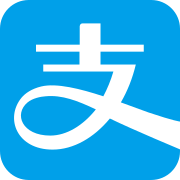
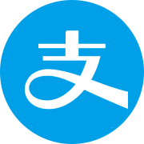
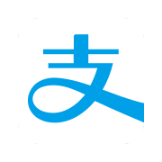
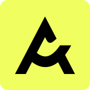
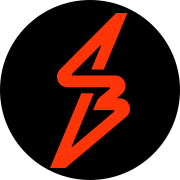
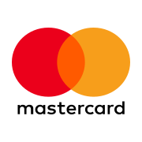

# 💸 Payment-Icon 💸

An repository contains a comprehensive collection of icons for various payment methods, banks, and wallets in Malaysia.  
These icons can be easily accessed and used by developers and designers to enhance the visual representation of their payment-related projects.  
Anyone who has access to the repository is welcome to add, modify, or improve the existing collection of icons.  

### 📏 Format 📐  
- Size: 180*180   
- Corner Radius: 15  
- Type: Square/Rounded/Transparent

 

Category: 
- [E-Wallet](#e-wallet)
- [BNPL](#bnpl)
- [Card](#card)
- [Mobile](#mobile)
- [Bank](#bank)

 

## E-Wallet
- [Alipay](#alipay)
- [Alipay+](#alipay-plus)
- [Binfinite](#binfinite)
- [Boost](#boost)
- [FavePay](#favepay)
- [Gopayz](#gopayz)
- [Lazada](#lazada)
- [MAE](#mae)
- [MCash](#mcash)
- [Presto](#presto)
- [Razer](#razer)
- [SarawakPay](#sarawakpay)
- [TNG](#tng)
- [Tapay](#tapay)
- [Truemoney](#truemoney)
- [WechatPay](#wechatpay)
- [Zapp](#zapp)

 
 

### Alipay

Source: 

| Version | Square | Rounded |
| -- | ----------------------------------------------------------------------------- | -----------------------------------------------------------------------------  | 
| V1 |  |  |
| V2 |  |  |

### Alipay Plus 

Source: 

| Version | Square | Rounded |
| -- | ----------------------------------------------------------------------------- | -----------------------------------------------------------------------------  | 
| V1 |  |  |
| V2 |  |  |

### Binfinite

Source: 

| Version | Square | Rounded |
| -- | ----------------------------------------------------------------------------- | -----------------------------------------------------------------------------  | 
| V1 |  |  |
| V2 |  |  |
| V3 |  |  |

### Boost

Source: 

| Version | Square | Rounded |
| -- | ----------------------------------------------------------------------------- | -----------------------------------------------------------------------------  | 
| V1 |  |  |
| V2 |  |  |
| V3 |  |  |

### FavePay

Source: 

| Version | Square | Rounded |
| -- | ----------------------------------------------------------------------------- | -----------------------------------------------------------------------------  | 
| V1 |  |  |
| V2 |  |  |

### Gopayz

Source: 

| Version | Square | Rounded |
| -- | ----------------------------------------------------------------------------- | -----------------------------------------------------------------------------  | 
| V1 |  |  |
| V2 |  |  |

### GrabPay

Source: 

| Version | Square | Rounded |
| -- | ----------------------------------------------------------------------------- | -----------------------------------------------------------------------------  | 
| V1 |  |  |
| V2 |  |  |
| V3 |  |  |
| V4 |  |  |

### Lazada

Source: 

| Version | Square | Rounded |
| -- | ----------------------------------------------------------------------------- | -----------------------------------------------------------------------------  | 
| V1 |  |  |
| V2 |  |  |

### MAE

Source: 

| Version | Square | Rounded |
| -- | ----------------------------------------------------------------------------- | -----------------------------------------------------------------------------  | 
| V1 |  |  |

### MCash

Source: 

| Version | Square | Rounded |
| -- | ----------------------------------------------------------------------------- | -----------------------------------------------------------------------------  | 
| V1 |  |  |
| V2 |  |  |

### Presto

Source: 

| Version | Square | Rounded |
| -- | ----------------------------------------------------------------------------- | -----------------------------------------------------------------------------  | 
| V1 |  |  |
| V2 |  |  |
| V3 |  |  |
| V4 |  |  |
| V5 |  |  |

### Razer

Source: 

| Version | Square | Rounded |
| -- | ----------------------------------------------------------------------------- | -----------------------------------------------------------------------------  | 
| V1 |  |  |

### SarawakPay

Source: 

| Version | Square | Rounded |
| -- | ----------------------------------------------------------------------------- | -----------------------------------------------------------------------------  | 
| V1 |  |  |
| V2 |  |  |

### Senheng

Source: 

| Version | Square | Rounded |
| -- | ----------------------------------------------------------------------------- | -----------------------------------------------------------------------------  | 
| V1 |  |  |
| V2 |  |  |

### Setel

Source: 

| Version | Square | Rounded |
| -- | ----------------------------------------------------------------------------- | -----------------------------------------------------------------------------  | 
| V1 |  |  |
| V2 |  |  |

### ShopeePay

Source: 

| Version | Square | Rounded |
| -- | ----------------------------------------------------------------------------- | -----------------------------------------------------------------------------  | 
| V1 |  |  |
| V2 |  |  |
| V3 |  |  |

### TNG

Source: 

| Version | Square | Rounded |
| -- | ----------------------------------------------------------------------------- | -----------------------------------------------------------------------------  | 
| V1 |  |  |

### Tapay

Source: 

| Version | Square | Rounded |
| -- | ----------------------------------------------------------------------------- | -----------------------------------------------------------------------------  | 
| V1 |  |  |
| V2 |  |  |

### Truemoney

Source: 

| Version | Square | Rounded |
| -- | ----------------------------------------------------------------------------- | -----------------------------------------------------------------------------  | 
| V1 |  |  |
| V2 |  |  |

### WechatPay

Source: 

| Version | Square | Rounded |
| -- | ----------------------------------------------------------------------------- | -----------------------------------------------------------------------------  | 
| V1 |  |  |
| V2 |  |  |
| V3 |  |  |

### Zapp

Source: 

| Version | Square | Rounded |
| -- | ----------------------------------------------------------------------------- | -----------------------------------------------------------------------------  | 
| V1 |  |  |

 

## BNPL
- [Ablr](#ablr)
- [Atome](#atome)
- [IOUPay](#ioupay)
- [ShopBack](#shopback)
- [Split](#split)

 
 

### Ablr

Source: 

| Version | Square | Rounded |
| -- | ----------------------------------------------------------------------------- | -----------------------------------------------------------------------------  | 
| V1 |  |  |
| V2 |  |  |

### Atome

Source: 

| Version | Square | Rounded |
| -- | ----------------------------------------------------------------------------- | -----------------------------------------------------------------------------  | 
| V1 |  |  |
| V2 |  |  |

### IOUPay

Source: 

| Version | Square | Rounded |
| -- | ----------------------------------------------------------------------------- | -----------------------------------------------------------------------------  | 
| V1 |  |  |
| V2 |  |  |

### ShopBack

Source: 

| Version | Square | Rounded |
| -- | ----------------------------------------------------------------------------- | -----------------------------------------------------------------------------  | 
| V1 |  |  |
| V2 |  |  |

### Split

Source: 

| Version | Square | Rounded |
| -- | ----------------------------------------------------------------------------- | -----------------------------------------------------------------------------  | 
| V1 |  |  |
| V2 |  |  |
| V3 |  |  |
| V4 |  |  |

 

## Card
- [Visa](#visa)
- [Master](#master)
- [UnionPay](#unionpay)
- [Gobiz](#gobiz)
- [Paydee](#paydee)

 
 

### Visa

Source: 

| Version | Square | Rounded | Transparent |
| -- | ----------------------------------------------------------------------------- | -----------------------------------------------------------------------------  | -----------------------------------------------------------------------------  | 
| V1 |  |  |  |
| V2 |  |  |  |

### Master

Source: 

| Version | Square | Rounded | Transparent |
| -- | ----------------------------------------------------------------------------- | -----------------------------------------------------------------------------  | -----------------------------------------------------------------------------  | 
| V1 |  |  |  |
| V2 |  |  | N/A |

### UnionPay

Source: 

| Version | Square | Rounded | Transparent |
| -- | ----------------------------------------------------------------------------- | -----------------------------------------------------------------------------  | -----------------------------------------------------------------------------  | 
| V1 |  |  |  |

### Gobiz

Source: 

| Version | Square | Rounded |
| -- | ----------------------------------------------------------------------------- | -----------------------------------------------------------------------------  | 
| V1 |  |  | 
| V2 |  |  | 

### Paydee

Source: 

| Version | Square | Rounded |
| -- | ----------------------------------------------------------------------------- | -----------------------------------------------------------------------------  | 
| V1 |  |  | 
| V2 |  |  | 

 

## Mobile
- [ApplePay](#applepay)
- [GooglePay](#googlepay)
- [SamsungPay](#samsungpay)

 
 

### ApplePay

Source: 

| Version | Square | Rounded | Transparent |
| -- | ----------------------------------------------------------------------------- | -----------------------------------------------------------------------------  | -----------------------------------------------------------------------------  | 
| V1 |  |  |  |
| V2 |  |  |  |

### GooglePay

Source: 

| Version | Square | Rounded | Transparent |
| -- | ----------------------------------------------------------------------------- | -----------------------------------------------------------------------------  | -----------------------------------------------------------------------------  | 
| V1 |  |  |  |
| V2 |  |  |  |
| V3 |  |  |  |

### SamsungPay

Source: 

| Version | Square | Rounded |
| -- | ----------------------------------------------------------------------------- | -----------------------------------------------------------------------------  | 
| V1 |  |  |
| V2 |  |  | 
| V3 |  |  | 

 

## Bank
- [DuitNow](#duitnow)
- [FPX](#fpx)
- [MaybankQR](#maybankqr)
- [Netspay](#netspay)

 
 

### DuitNow

Source: 

| Version | Square | Rounded |
| -- | ----------------------------------------------------------------------------- | -----------------------------------------------------------------------------  | 
| V1 |  |  |
| V2 |  |  | 
| V3 |  |  | 
| V4 |  |  | 

### FPX

Source: 

| Version | Square | Rounded |
| -- | ----------------------------------------------------------------------------- | -----------------------------------------------------------------------------  | 
| V1 |  |  |
| V2 |  |  | 
| V3 |  |  | 

### MaybankQR

Source: 

| Version | Square | Rounded |
| -- | ----------------------------------------------------------------------------- | -----------------------------------------------------------------------------  | 
| V1 |  |  |

### NetsPay

Source: 

| Version | Square | Rounded |
| -- | ----------------------------------------------------------------------------- | -----------------------------------------------------------------------------  | 
| V1 |  |  |

