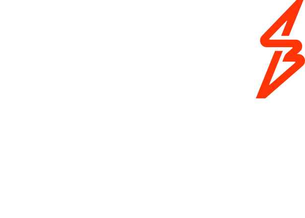

# Payment-Icon

An repository contains a comprehensive collection of icons for various payment methods, banks, and wallets in Malaysia.  
These icons can be easily accessed and used by developers and designers to enhance the visual representation of their payment-related projects.  
Anyone who has access to the repository is welcome to add, modify, or improve the existing collection of icons.

Category: 
- [E-Wallet](#e-wallet)
- [BNPL](#bnpl)
- [Card](#card)
- [Mobile](#mobile)
- [Bank](#bank)

# E-Wallet

- Alipay
- Alipay+
- Binfinite
- Boost
- FavePay
- Gopayz
- Lazada
- MAE
- MCash
- Presto
- Razer
- SarawakPay
- TNG
- Tapay
- Truemoney
- WechatPay
- Zapp

##  Alipay

Source: 

| Version | Square | Rounded |
| -- | ----------------------------------------------------------------------------- | -----------------------------------------------------------------------------  | 
| V1 |  |  |
| V2 |  |  |

##  Alipay+ 

Source: 

| Version | Square | Rounded |
| -- | ----------------------------------------------------------------------------- | -----------------------------------------------------------------------------  | 
| V1 |  |  |
| V2 |  |  |

##  Binfinite

Source: 

| Version | Square | Rounded |
| -- | ----------------------------------------------------------------------------- | -----------------------------------------------------------------------------  | 
| V1 |  |  |
| V2 |  |  |
| V3 |  |  |

##  Boost

Source: 

| Version | Square | Rounded |
| -- | ----------------------------------------------------------------------------- | -----------------------------------------------------------------------------  | 
| V1 |  |  |
| V2 |  |  |
| V3 |  |  |

##  FavePay

Source: 

| Version | Square | Rounded |
| -- | ----------------------------------------------------------------------------- | -----------------------------------------------------------------------------  | 
| V1 |  |  |
| V2 |  |  |

##  Gopayz

Source: 

| Version | Square | Rounded |
| -- | ----------------------------------------------------------------------------- | -----------------------------------------------------------------------------  | 
| V1 |  |  |
| V2 |  |  |

##  GrabPay

Source: 

| Version | Square | Rounded |
| -- | ----------------------------------------------------------------------------- | -----------------------------------------------------------------------------  | 
| V1 |  |  |
| V2 |  |  |
| V3 |  |  |
| V4 |  |  |

##  Lazada

Source: 

| Version | Square | Rounded |
| -- | ----------------------------------------------------------------------------- | -----------------------------------------------------------------------------  | 
| V1 |  |  |
| V2 |  |  |

##  MAE

Source: 

| Version | Square | Rounded |
| -- | ----------------------------------------------------------------------------- | -----------------------------------------------------------------------------  | 
| V1 |  |  |

##  MCash

Source: 

| Version | Square | Rounded |
| -- | ----------------------------------------------------------------------------- | -----------------------------------------------------------------------------  | 
| V1 |  |  |
| V2 |  |  |

##  Presto

Source: 

| Version | Square | Rounded |
| -- | ----------------------------------------------------------------------------- | -----------------------------------------------------------------------------  | 
| V1 |  |  |
| V2 |  |  |
| V3 |  |  |
| V4 |  |  |
| V5 |  |  |

##  Razer

Source: 

| Version | Square | Rounded |
| -- | ----------------------------------------------------------------------------- | -----------------------------------------------------------------------------  | 
| V1 |  |  |

##  SarawakPay

Source: 

| Version | Square | Rounded |
| -- | ----------------------------------------------------------------------------- | -----------------------------------------------------------------------------  | 
| V1 |  |  |
| V2 |  |  |

##  Senheng

Source: 

| Version | Square | Rounded |
| -- | ----------------------------------------------------------------------------- | -----------------------------------------------------------------------------  | 
| V1 |  |  |
| V2 |  |  |

##  Setel

Source: 

| Version | Square | Rounded |
| -- | ----------------------------------------------------------------------------- | -----------------------------------------------------------------------------  | 
| V1 |  |  |
| V2 |  |  |

##  ShopeePay

Source: 

| Version | Square | Rounded |
| -- | ----------------------------------------------------------------------------- | -----------------------------------------------------------------------------  | 
| V1 |  |  |
| V2 |  |  |
| V3 |  |  |

##  TNG

Source: 

| Version | Square | Rounded |
| -- | ----------------------------------------------------------------------------- | -----------------------------------------------------------------------------  | 
| V1 |  |  |

##  Tapay

Source: 

| Version | Square | Rounded |
| -- | ----------------------------------------------------------------------------- | -----------------------------------------------------------------------------  | 
| V1 |  |  |
| V2 |  |  |

##  Truemoney

Source: 

| Version | Square | Rounded |
| -- | ----------------------------------------------------------------------------- | -----------------------------------------------------------------------------  | 
| V1 |  |  |
| V2 |  |  |

##  WechatPay

Source: 

| Version | Square | Rounded |
| -- | ----------------------------------------------------------------------------- | -----------------------------------------------------------------------------  | 
| V1 |  |  |
| V2 |  |  |
| V3 |  |  |

##  Zapp

Source: 

| Version | Square | Rounded |
| -- | ----------------------------------------------------------------------------- | -----------------------------------------------------------------------------  | 
| V1 |  |  |

# BNPL

- Ablr
- Atome
- IOUPay
- ShopBack
- Split

##  Ablr

Source: 

| Version | Square | Rounded |
| -- | ----------------------------------------------------------------------------- | -----------------------------------------------------------------------------  | 
| V1 |  |  |
| V2 |  |  |

##  Atome

Source: 

| Version | Square | Rounded |
| -- | ----------------------------------------------------------------------------- | -----------------------------------------------------------------------------  | 
| V1 |  |  |
| V2 |  |  |

##  IOUPay

Source: 

| Version | Square | Rounded |
| -- | ----------------------------------------------------------------------------- | -----------------------------------------------------------------------------  | 
| V1 |  |  |
| V2 |  |  |

##  ShopBack

Source: 

| Version | Square | Rounded |
| -- | ----------------------------------------------------------------------------- | -----------------------------------------------------------------------------  | 
| V1 |  |  |
| V2 |  |  |

##  Split

Source: 

| Version | Square | Rounded |
| -- | ----------------------------------------------------------------------------- | -----------------------------------------------------------------------------  | 
| V1 |  |  |
| V2 |  |  |
| V3 |  |  |
| V4 |  |  |

# Card

- Visa
- Master
- UnionPay
- Gobiz
- Paydee

##  Visa

Source: 

| Version | Square | Rounded | Transparent |
| -- | ----------------------------------------------------------------------------- | -----------------------------------------------------------------------------  | -----------------------------------------------------------------------------  | 
| V1 |  |  |  |
| V2 |  |  |  |

##  Master

Source: 

| Version | Square | Rounded | Transparent |
| -- | ----------------------------------------------------------------------------- | -----------------------------------------------------------------------------  | -----------------------------------------------------------------------------  | 
| V1 |  |  |  |
| V2 |  |  | N/A |

##  UnionPay

Source: 

| Version | Square | Rounded | Transparent |
| -- | ----------------------------------------------------------------------------- | -----------------------------------------------------------------------------  | -----------------------------------------------------------------------------  | 
| V1 |  |  |  |

##  Gobiz

Source: 

| Version | Square | Rounded |
| -- | ----------------------------------------------------------------------------- | -----------------------------------------------------------------------------  | 
| V1 |  |  | 
| V2 |  |  | 

##  Paydee

Source: 

| Version | Square | Rounded |
| -- | ----------------------------------------------------------------------------- | -----------------------------------------------------------------------------  | 
| V1 |  |  | 
| V2 |  |  | 

# Mobile

- ApplePay
- GooglePay
- SamsungPay

##  ApplePay

Source: 

| Version | Square | Rounded | Transparent |
| -- | ----------------------------------------------------------------------------- | -----------------------------------------------------------------------------  | -----------------------------------------------------------------------------  | 
| V1 |  |  |  |
| V2 |  |  |  |

##  GooglePay

Source: 

| Version | Square | Rounded | Transparent |
| -- | ----------------------------------------------------------------------------- | -----------------------------------------------------------------------------  | -----------------------------------------------------------------------------  | 
| V1 |  |  |  |
| V2 |  |  |  |
| V3 |  |  |  |

##  SamsungPay

Source: 

| Version | Square | Rounded |
| -- | ----------------------------------------------------------------------------- | -----------------------------------------------------------------------------  | 
| V1 |  |  |
| V2 |  |  | 
| V3 |  |  | 

# Bank

- DuitNow
- FPX
- MaybankQR
- Netspay

##  DuitNow

Source: 

| Version | Square | Rounded |
| -- | ----------------------------------------------------------------------------- | -----------------------------------------------------------------------------  | 
| V1 |  |  |
| V2 |  |  | 
| V3 |  |  | 
| V4 |  |  | 

##  FPX

Source: 

| Version | Square | Rounded |
| -- | ----------------------------------------------------------------------------- | -----------------------------------------------------------------------------  | 
| V1 |  |  |
| V2 |  |  | 
| V3 |  |  | 

##  MaybankQR

Source: 

| Version | Square | Rounded |
| -- | ----------------------------------------------------------------------------- | -----------------------------------------------------------------------------  | 
| V1 |  |  |

##  NetsPay

Source: 

| Version | Square | Rounded |
| -- | ----------------------------------------------------------------------------- | -----------------------------------------------------------------------------  | 
| V1 |  |  |

